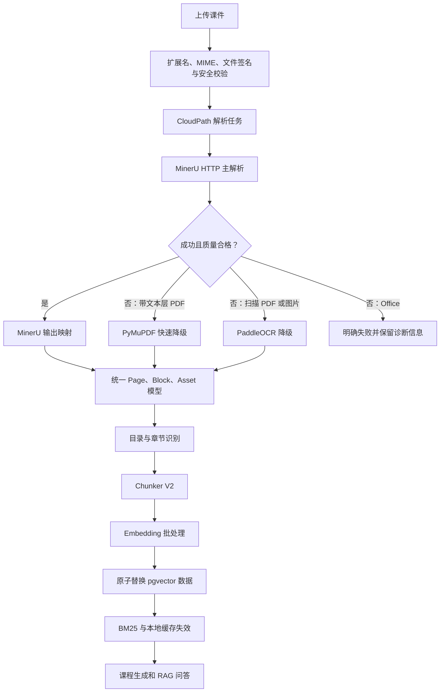

# CloudPath MinerU 解析与 RAG 升级实施方案

> 文档状态：实施完成（阶段 0～6 均已通过）  
> 方案版本：1.0  
> 编制日期：2026-07-13；状态更新：2026-07-14  
> 实施状态：阶段 0、1、2、3、4、5、6 已完成并通过独立审核  
> 最新授权：用户已批准完成剩余方案，无需逐阶段人工确认；每阶段仍须先执行独立审核，达到本阶段标准后才可自动继续。共享/生产数据库迁移、删除历史数据和批量历史重解析仍须单独明确批准。

## 1. 文档目的

本方案用于指导 CloudPath App 完成以下三项改进：

1. 将 MinerU 设置为默认主解析器，通过 HTTP 调用本地 CUDA 版 MinerU；PDF 解析失败时使用 PyMuPDF 快速降级，扫描 PDF 和图片解析失败时使用 PaddleOCR 降级。
2. 将当前“一块文本一个 chunk”的 RAG 切片方式升级为结构化、语义化、可追溯的 Chunker V2，并让解析完成后的内容真正进入配置的向量索引。
3. 将上传文件范围扩展到本地 MinerU 当前支持的格式，并补齐后端安全校验、前端选择器、预览与引用兼容。

本方案同时规定阶段审核制度，确保每个阶段均可独立验证、回退和批准。

## 2. 审批与阶段停止制度

### 2.0 后续授权覆盖说明

用户在阶段 1 后明确要求“完成这个文档剩余的部分无需我一个一个确认”，并要求每完成一部分都先对照审核标准验证。因此，本节原定的“每阶段等待用户口令”已被后续授权替换为：

```text
实施本阶段 → 提交机器可读证据和审核报告 → 审核通过后自动进入下一阶段
                                      └→ 审核失败则停止并返工
```

该授权只取消逐阶段等待，不扩大数据操作范围。删除历史数据、批量重解析、共享/生产数据库迁移和生产配置切换仍执行 2.2 的单独批准要求。

### 2.1 状态流转

每个实施阶段必须按照以下状态流转：

```text
未开始
  → 用户批准进入本阶段
  → 实施中
  → 待审核
  → 停止实施并提交审核材料
  → 用户批准通过 / 要求返工
  → 通过后才允许进入下一阶段
```

### 2.2 强制停止规则

- 本文档未获用户明确同意前，不进行任何方案代码实施。
- 每完成一个阶段，必须停止修改代码和配置。
- 停止后只允许执行与本阶段审核直接相关的只读检查或用户要求的返工。
- 不得以“测试已经通过”“改动较小”或“下一阶段存在依赖”为理由自动进入下一阶段。
- 用户要求返工时，本阶段重新进入“实施中”，返工完成后再次停止审核。
- 涉及删除历史数据、批量重解析、共享/生产数据库迁移或生产配置切换时，即使属于已批准阶段，也必须再次取得针对该操作的明确批准。一次性隔离测试库中的建表、迁移和删除测试可以作为阶段审核证据，但不得指向现有共享数据。

### 2.3 审核批准口令

建议使用以下明确表述：

```text
批准实施本方案，进入阶段 0
批准阶段 0，进入阶段 1
批准阶段 1，进入阶段 2
批准阶段 2，进入阶段 3
批准阶段 3，进入阶段 4
批准阶段 4，进入阶段 5
批准阶段 5，进入阶段 6
批准阶段 6，方案实施完成
```

“继续”“看起来可以”“你处理吧”等存在歧义的表述，需要先确认具体批准的阶段。

### 2.4 每阶段必须提交的审核材料

每个阶段完成后，审核报告至少包括：

1. 本阶段目标及完成情况。
2. 实际修改的文件清单。
3. 关键设计决定和与方案的偏差。
4. 自动化测试命令、测试数量和结果。
5. 手工验证步骤及结果。
6. 未解决问题和已知风险。
7. 回退方式。
8. 下一阶段拟实施内容。
9. 明确声明“当前已停止，等待用户审核”。

## 3. 当前基线与问题

### 3.1 解析器现状

- 当前默认解析器配置为 `auto`。
- 带文本层 PDF 会依次尝试 MinerU、Marker 和 PyMuPDF，但 MinerU HTTP 调用尚未实现，实际通常回退到 PyMuPDF。
- 扫描 PDF 和图片会直接进入 OCR，不会优先使用 MinerU。
- 当前默认 OCR provider 为 `mock`，无法为真实扫描课件提供可用正文。
- MinerU 适配器要求外部程序直接生成 CloudPath 自定义的 `pages.json`，与 MinerU 官方 HTTP 输出不兼容。

主要关联代码：

- `backend/app/core/config.py`
- `backend/app/document/parsers/router.py`
- `backend/app/document/parsers/external.py`
- `backend/app/document/parsers/mineru_parser.py`
- `backend/app/document/pipeline.py`

### 3.2 RAG 现状

- 当前基本按照每个解析 block 生成一个 chunk。
- 没有语义合并、token 上限、最小长度或 overlap。
- 标题层级、表格、公式和图片说明没有被充分用于切片。
- 解析 pipeline 中的 `rag_indexing` 阶段只构建并写入 `chunks.jsonl`，没有调用 `upsert_chunks()` 写入 pgvector。
- 当前 Chunk 模型没有使用数据库已有的 `parser`、`quality_score` 和 `token_count` 等字段。
- 重新解析或调整章节后，外部向量索引可能残留旧 chunk。

主要关联代码：

- `backend/app/document/chunker.py`
- `backend/app/schemas/books.py`
- `backend/app/rag/index_base.py`
- `backend/app/rag/index_pgvector.py`
- `backend/app/rag/index_factory.py`
- `backend/app/document/rebuilder.py`

### 3.3 上传格式现状

- 后端仅允许 PDF、PNG、JPG、JPEG 和 WEBP。
- 前端文件选择器已经包含 `.doc` 和 `.docx`，与后端不一致。
- 当前本地 MinerU 支持 PDF、八类图片以及 DOCX、PPTX、XLSX，不支持旧版 DOC、PPT、XLS。
- Office 文件没有对应的安全校验、页数语义、页面预览和引用显示策略。

主要关联代码：

- `backend/app/services/storage.py`
- `backend/app/services/upload_validation.py`
- `backend/app/document/detector.py`
- `backend/app/api/routes_books.py`
- `frontend/src/screens/shared.tsx`
- `frontend/src/screens/UploadScreen.tsx`

## 4. 目标架构



## 5. 最终解析路由规则

| 输入类型 | 主解析器 | 第一次降级 | 第二次降级 | 最终行为 |
|---|---|---|---|---|
| 带文本层 PDF | MinerU | PyMuPDF | PaddleOCR | 全部失败则任务失败 |
| 扫描 PDF | MinerU | PaddleOCR | 无 | 全部失败则任务失败 |
| 混合型 PDF | MinerU | PaddleOCR | PyMuPDF 保留可读页 | 标记缺失页并提示人工复核 |
| 图片 | MinerU | PaddleOCR | 无 | 全部失败则任务失败 |
| DOCX | MinerU | 无 | 无 | MinerU 失败则明确失败 |
| PPTX | MinerU | 无 | 无 | MinerU 失败则明确失败 |
| XLSX | MinerU | 无 | 无 | MinerU 失败则明确失败 |

降级解析不得覆盖 MinerU 的原始失败信息。最终 `parser_report.json` 必须记录完整尝试链、耗时、失败类型和实际生效解析器。

### 5.1 逐阶段格式启用边界

| 阶段 | 外部上传入口 | 内部 fixture/单元测试 | 说明 |
|---|---|---|---|
| 阶段 0～1 | 保持现有 PDF/图片范围 | 可以准备全部格式 fixture | 不改变用户可见行为 |
| 阶段 2 | 仅 PDF/当前图片格式 | 可以测试 Office mapper | MinerU 主路由只对现有上传范围生效 |
| 阶段 3～4 | 仍保持现有上传范围 | 可以测试 Office 类型化 chunk | Office 规则在内部验证，不提前开放上传 |
| 阶段 5 | 开放最终白名单 | 全部格式端到端测试 | 前后端、安全、预览和引用同时上线 |

因此，阶段 2 的“所有文件优先 MinerU”仅指当时对外已启用的 PDF 和图片。DOCX、PPTX、XLSX 直到阶段 5 审核通过后才进入正式上传入口。

### 5.2 降级状态机和混合 PDF 合并

质量阈值必须在阶段 0 基于冻结样本确定，阶段 2 不得自行降低阈值。解析决策按以下状态处理：

| MinerU 结果 | PDF/图片行为 | Office 行为 |
|---|---|---|
| 服务不可用、任务失败或结果整体无效 | 按类型进入 PyMuPDF/PaddleOCR | 明确失败 |
| 整体成功且达到质量阈值 | 使用 MinerU 全量结果 | 使用 MinerU 全量结果 |
| 部分页面缺失或低质量 | 仅对问题页面执行适用降级并合并 | 明确失败并保留诊断，不拼接不完整 Office 结果 |
| 超时 | 将当前解析 generation 标为已终止并降级 | 明确失败 |

混合 PDF 的页面级规则：

1. MinerU 质量合格的页面优先保留。
2. 问题页面有可靠文本层时优先使用 PyMuPDF。
3. 问题页面没有可靠文本层时使用 PaddleOCR。
4. 合并结果必须按原始页序排列，页码唯一且连续；同一来源 block 通过内容哈希和 bbox 去重。
5. 无法恢复的页面保留缺页警告，但不得使用占位文本冒充正文。
6. `parser_report.json` 记录每页实际 parser、质量分、降级原因和缺失状态。
7. mixed-PDF golden tests 必须覆盖前部文本/后部扫描、交错页面、单页低质量和局部超时模拟。

## 6. MinerU HTTP 调用设计

### 6.1 接口流程

CloudPath 使用本地 MinerU 异步接口：

1. `GET /health`：解析前健康检查。
2. `POST /tasks`：以 multipart/form-data 提交文件及解析参数。
3. `GET /tasks/{task_id}`：轮询 `pending`、`processing`、`completed`、`failed` 状态。
4. `GET /tasks/{task_id}/result`：获取解析结果。

不在 CloudPath 后端进程中再次加载 MinerU 模型，避免显存中出现两份模型。

### 6.2 默认请求参数

```text
backend=pipeline
parse_method=auto
lang_list=ch
formula_enable=true
table_enable=true
image_analysis=true
return_md=true
return_middle_json=true
return_content_list=true
return_images=true
response_format_zip=false
```

`backend`、语言、公式、表格、超时和轮询间隔都必须通过 CloudPath 配置覆盖。

### 6.3 建议新增配置

以下是阶段 2 审核通过后的目标配置。阶段 1 只增加配置读取能力，`BOOKCOURSE_PARSER_PROVIDER` 默认值仍保持 `auto`，不得提前切换生产路由。

```env
BOOKCOURSE_PARSER_PROVIDER=mineru
BOOKCOURSE_MINERU_ENDPOINT=http://127.0.0.1:8001
BOOKCOURSE_MINERU_BACKEND=pipeline
BOOKCOURSE_MINERU_PARSE_METHOD=auto
BOOKCOURSE_MINERU_TIMEOUT_SECONDS=900
BOOKCOURSE_MINERU_CONNECT_TIMEOUT_SECONDS=10
BOOKCOURSE_MINERU_POLL_INTERVAL_SECONDS=2
BOOKCOURSE_MINERU_MAX_RETRIES=2
BOOKCOURSE_MINERU_FORMULA_ENABLE=true
BOOKCOURSE_MINERU_TABLE_ENABLE=true
BOOKCOURSE_MINERU_RETURN_IMAGES=true
BOOKCOURSE_OCR_PROVIDER=paddle
BOOKCOURSE_OCR_LANGUAGE=ch
```

### 6.4 HTTP 错误分类

| 类型 | 示例 | 行为 |
|---|---|---|
| 服务不可用 | 拒绝连接、健康检查 503 | 进入兼容的降级解析器 |
| 临时错误 | HTTP 500/502/503/504 | 有上限重试，之后降级 |
| 任务超时 | 超过配置总时限 | 记录 MinerU task ID，停止轮询并降级 |
| 任务失败 | MinerU 状态为 `failed` | 保存错误详情并降级 |
| 请求配置错误 | HTTP 400/422 | 视为 CloudPath 配置或适配缺陷，不盲目重试 |
| 结果损坏 | 缺少 content list 或 JSON 无法校验 | 记录响应摘要并降级 |
| 排队或限流 | HTTP 429、queued_ahead 较高 | 尊重 Retry-After 或指数退避，不重复提交 |

不得把用户文件内容、完整解析正文或敏感路径写入普通错误日志。

### 6.5 异步任务生命周期与幂等性

- CloudPath 使用文件 SHA-256、book ID 和 parse generation 生成本地幂等键。
- 一旦取得 MinerU task ID，状态轮询失败不得重新 `POST /tasks`；应使用原 task ID 恢复查询。
- 如果提交连接中断且无法确认是否已受理，不得自动无限重提；最多执行一次受控核对，并在无法核对时交由降级或人工重试。
- 记录 MinerU 的任务保留时间和清理策略，阶段 0 验证本地服务实际 TTL。
- 如果当前 MinerU API 没有取消接口，文档和审核报告必须明确这一限制；CloudPath 只能停止等待，不能宣称已停止 GPU 上的上游任务。
- 解析超时或降级完成后，迟到的 MinerU 结果必须通过 parse generation 校验丢弃，不得覆盖新结果。
- 429 和排队状态采用退避，不能通过重复提交扩大 GPU 队列。
- 审核必须覆盖重复回调、迟到完成、CloudPath 重启后恢复轮询和 MinerU 清理任务后的 404。

## 7. MinerU 输出映射设计

建议新增以下模块：

```text
backend/app/document/mineru/
├── client.py
├── exceptions.py
├── mapper.py
├── models.py
└── quality.py
```

映射规则：

| MinerU 内容 | CloudPath 目标 |
|---|---|
| title | 标题 block，保留标题层级 |
| text | paragraph block |
| list | list block，保留项目符号 |
| equation | formula block，保留 LaTeX |
| table | table block，正文采用 Markdown 或结构化表格文本 |
| image | Asset 和 figure block |
| image caption | Asset caption，并关联正文 chunk |
| page index | 通用 source page |
| bbox | 页面引用坐标 |

规范化产物至少包括：

```text
scan_result.json
parser_report.json
pages.json
mineru_content_list.json
mineru_middle.json
chapters.json
chunks.jsonl
assets.json
```

原始 MinerU 结果用于审计和重新映射，CloudPath 下游只依赖规范化模型。

## 8. Chunker V2 设计

### 8.1 默认参数

```env
BOOKCOURSE_CHUNK_TARGET_TOKENS=450
BOOKCOURSE_CHUNK_MAX_TOKENS=700
BOOKCOURSE_CHUNK_MIN_TOKENS=120
BOOKCOURSE_CHUNK_OVERLAP_TOKENS=80
BOOKCOURSE_CHUNK_QUALITY_THRESHOLD=0.45
BOOKCOURSE_CHUNK_VERSION=v2
```

参数在基准测试后可调整，但调整必须记录原因和检索结果变化。

阶段 0 必须冻结切片计算协议：

- 固定 tokenizer 名称、模型版本和依赖版本。
- `token_count` 以最终送入 embedding 的完整文本计算，包括标题路径、正文以及因 overlap 重复进入本 chunk 的文本；不包括只保存在 metadata 中的字段。
- 最大 token 限制适用于上述完整 embedding 文本。
- 短尾块的合并规则和允许低于最小 token 的条件必须固定。
- 表格、公式等原子内容超限时必须拆分；若存在不可拆分例外，需要定义独立硬上限和告警，不能无限超限。
- 重复 chunk 比例以冻结的标准化文本哈希计算，overlap 引入的预期重复使用单独指标统计。
- `quality_score` 的输入项、权重、归一化公式和阈值必须版本化；至少考虑有效字符率、乱码率、OCR 置信度、重复率和缺失 block。

### 8.2 切片规则

- 使用章节和标题层级维护 `heading_path`。
- 同一标题下相邻短段落合并，不再机械地按 block 生成 chunk。
- 页面边界不是强制 chunk 边界，但每个 chunk 必须保存起止页。
- 相邻 chunk 保留配置化 overlap。
- 页眉、页脚、纯页码、重复水印不进入普通 RAG 正文。
- 低于质量阈值的文本进入隔离状态，不参与默认检索。
- 每个 chunk 的 embedding 文本包含标题路径和正文。
- chunk ID 基于版本、内容哈希和来源范围稳定生成。

### 8.3 特殊内容

表格：

- 小表格保持为一个原子 chunk。
- 大表格按行拆分，并在每个子 chunk 重复表头。
- 保留表格标题、章节路径和页码。

公式：

- 保留 LaTeX。
- 优先与前后解释段落组合。
- 独立公式必须包含附近标题或说明，避免只索引符号。

图片：

- 图片保存为 Asset。
- 图片标题和 MinerU 图片分析结果进入 figure chunk。
- 图片和所在页面、章节及相关正文 chunk 建立双向关联。

PPTX：

- 每张幻灯片作为一个 source page。
- 幻灯片标题进入 heading path。
- 正文、表格、图表和图片保留同页关系。

XLSX：

- 工作表名称作为标题层级。
- 表格按区域或行段切分。
- chunk 保存工作表名称和单元格范围。

### 8.4 Chunk 模型扩展

建议向 Chunk 增加以下可选字段，保持现有 API 向后兼容：

```text
parser
parser_version
chunk_version
heading_path
source_block_ids
quality_score
token_count
content_hash
bbox
metadata
```

## 9. 向量索引一致性设计

解析完成后的 `rag_indexing` 必须执行真实索引：

```text
生成 chunks
  → 批量生成 embeddings
  → 在数据库事务中删除本书旧 chunks
  → 插入新 chunks 和 embeddings
  → 校验数量
  → 提交事务
  → 失效 BM25 和本地 embedding 缓存
```

一致性要求：

- 数据库写入失败时不能显示 RAG 索引成功。
- pgvector 中的有效 chunk 数必须与本次可索引 chunk 数一致。
- 重解析和章节重建都必须触发索引替换。
- 删除书籍时必须删除向量和 BM25 相关数据。
- Artifact fallback 仍可保留，但必须在状态报告中明确标记未使用 pgvector。
- 历史课程不会自动迁移；批量重解析属于独立高风险操作，需要另行批准。

### 9.1 并发与跨索引一致性

- 每次解析生成单调递增的 `parse_generation`，每次索引生成 `index_generation`。
- 同一 book 的解析、章节重建和索引写入使用 per-book 锁或等价的 compare-and-swap 条件。
- 只有 generation 仍为当前值的任务可以提交结果，旧任务迟到时必须放弃写入。
- chunks 记录 embedding model、model version、dimension 和 chunk version；查询端只读取兼容 generation。
- pgvector 提交后，BM25 与缓存更新必须使用同一 index generation。失败时进入可重试的“索引未完全就绪”状态，不能对用户宣称完成。
- 缓存键包含 index generation，避免旧缓存和新 pgvector 混用。
- 阶段 4 必须执行并发重解析、章节重建竞争、提交后缓存失效失败和 embedding 维度不匹配的故障注入测试。

## 10. 上传文件范围与安全设计

### 10.1 目标白名单

```text
.pdf
.png
.jpeg
.jp2
.webp
.gif
.bmp
.jpg
.tiff
.docx
.pptx
.xlsx
```

`.tif`、动画 GIF 和多页 TIFF 的行为必须在阶段 0 通过本地 MinerU 实测后冻结：

- `.tif` 默认不开放，除非确认 MinerU 与安全校验均支持该别名。
- 动画 GIF 必须明确为“逐帧作为 source page”或“拒绝动画，仅接受单帧”，不能静默只取第一帧。
- 多页 TIFF 必须明确为“逐页解析”或“拒绝多页”，页序和页数必须可验证。

本方案不包含：

- `.doc`
- `.ppt`
- `.xls`
- 网页 URL
- 加密 PDF
- 带密码 Office 文件

若未来需要旧版 Office，应新增“可信转换为 OOXML/PDF”的独立方案，不能只放宽扩展名。

### 10.2 MIME 与签名校验

- PDF 检查 `%PDF-` 文件签名并执行页数限制。
- 图片检查真实文件签名、尺寸和像素上限。
- DOCX/PPTX/XLSX 检查 ZIP 签名和 OOXML 包结构。
- DOCX 必须包含 `[Content_Types].xml` 和 `word/`。
- PPTX 必须包含 `[Content_Types].xml` 和 `ppt/`。
- XLSX 必须包含 `[Content_Types].xml` 和 `xl/`。
- 限制 ZIP 条目数量、单项大小、解压后总大小和压缩比。
- 拒绝绝对路径、`..` 路径和其他 ZIP 路径穿越形式。
- 校验 OOXML `[Content_Types].xml` 中的真实文档类型，而不只检查目录名。
- 校验 relationships，拒绝或隔离外部文件、网络资源和危险 URI。
- XML 解析必须禁用外部实体和 DTD，避免 XXE。
- 拒绝加密 OOXML、嵌套压缩包和超过资源上限的文档。
- MinerU 调用必须有 CPU、内存、页数/幻灯片/工作表数量和总处理时限。

### 10.3 前端和预览

- 文件选择器与后端白名单保持同源或建立自动化一致性测试。
- 删除前端当前允许但后端及 MinerU 不支持的 `.doc`。
- 上传页明确显示 PDF、图片、Word、PowerPoint 和 Excel。
- PDF 使用“第 X 页”；PPTX 使用“第 X 张幻灯片”；XLSX 使用“工作表/区域”。DOCX 若 MinerU 提供稳定页码则显示页码，否则使用“标题路径 + 段落/块序号”，不得虚构物理页码。
- Office 原文件无法直接渲染时，优先展示 MinerU 生成的预览产物；若没有预览，则显示文件类型封面和结构化正文，不能调用仅支持 PDF 的渲染接口。

## 11. 分阶段实施与审核标准

## 阶段 0：基线、样本与安全准备

### 目标

在修改行为前建立可重复的解析和检索基线，确认工作区现状，并准备覆盖所有关键格式的测试样本。

### 任务

- 记录当前配置、依赖和解析路由。
- 运行现有后端与前端测试，保存基线结果。
- 建立不包含敏感信息的小型测试语料集。
- 样本覆盖原生 PDF、扫描 PDF、混合 PDF、多栏 PDF、表格、公式、图片以及 DOCX/PPTX/XLSX。
- 定义并冻结解析质量、切片质量、检索质量、安全和性能的数值阈值及允许偏差；后续修改阈值需要在阶段审核中说明并取得用户批准。
- 冻结指标计算协议，包括 tokenizer/version、token 计数范围、重复率公式、quality score 公式和原子内容超限规则。
- 确认本地 MinerU `/health`、CUDA 可用性及 API 版本。
- 实测 `.tif`、动画 GIF、多页 TIFF、DOCX 引用位置和 MinerU 任务 TTL，冻结格式语义矩阵。

### 交付物

- 基线测试报告。
- 测试样本清单和来源说明。
- 当前架构与配置快照。
- MinerU 健康状态和 GPU 调用证据。
- 后续阶段使用的验收测试矩阵。
- 带版本号的验收阈值、标注查询集和格式语义矩阵。
- 带版本号的指标计算协议。

### 审核标准

- [x] 工作区原有改动已经识别并确认不会被覆盖。
- [x] 后端和前端基线测试结果可重复。
- [x] 每类目标文件至少有一个合法样本。
- [x] 至少包含一个损坏文件和一个伪造扩展名样本。
- [x] MinerU 服务健康检查通过。
- [x] MinerU 解析样本时能够确认使用 CUDA。
- [x] 已记录当前解析耗时、有效文本率、chunk 数和基础检索结果。
- [x] 已冻结成功率、Recall@5、引用准确率、允许性能变化、OOM 容忍值等可量化阈值。
- [x] tokenizer、token 计数范围、重复率、quality score、短尾块和原子内容超限规则已冻结。
- [x] `.tif`、动画 GIF、多页 TIFF、DOCX 定位和 MinerU TTL 已有明确决定。
- [x] 本阶段没有改变生产解析行为。

### 阶段停止点

提交阶段 0 审核报告并停止。用户批准前不得开发 MinerU HTTP 适配器。

## 阶段 1：MinerU HTTP 客户端与响应模型

### 目标

实现独立、可测试的 MinerU HTTP 调用能力，但暂不切换默认解析路由。

### 任务

- 添加 HTTP 客户端依赖和配置项。
- 实现健康检查、任务提交、状态轮询和结果获取。
- 为 MinerU 请求和响应建立显式模型。
- 实现连接超时、总超时、有限重试和错误分类。
- 实现本地幂等键、parse generation、迟到结果保护和重启后轮询恢复所需的任务状态持久化。
- 保存 MinerU task ID 和必要诊断元数据。
- 使用模拟 HTTP 服务完成异常路径测试。

### 交付物

- MinerU client、models 和 exceptions 模块。
- 配置说明和环境变量示例。
- HTTP 单元测试及模拟故障测试。
- 一次真实本地 MinerU 调用记录。

### 审核标准

- [x] `/health` 成功、失败和超时均有测试。
- [x] `/tasks` multipart 请求字段与本地 MinerU API 一致。
- [x] `pending`、`processing`、`completed`、`failed` 状态均有测试。
- [x] 5xx 重试次数有上限，4xx 不进行无意义重试。
- [x] 总超时后不会无限占用 CloudPath worker。
- [x] 已取得 task ID 后的轮询故障不会重复提交文件。
- [x] 429、排队退避、迟到结果、重复结果、重启恢复和任务过期 404 均有测试。
- [x] 若 MinerU 没有取消接口，审核材料明确说明超时后上游任务可能继续运行。
- [x] 错误日志不包含完整课件正文或敏感本地路径。
- [x] HTTP 客户端可以独立运行，但尚未改变默认 parser 路由。
- [x] 现有测试保持通过。

### 阶段停止点

提交阶段 1 审核报告并停止。用户批准前不得把 MinerU 设置为默认解析器。

## 阶段 2：MinerU 映射、主路由与降级策略

### 目标

将 MinerU 输出转换为 CloudPath 规范化产物，并正式实现 MinerU 主解析、PyMuPDF/PaddleOCR 降级。

### 任务

- 实现 `middle_json`、`content_list` 和图片资源映射。
- 生成兼容的 `pages.json`、Assets 和 parser report。
- 实现解析质量门禁。
- 实现页面级降级状态机、mixed-PDF 合并、页序校验和 block 去重。
- 将所有白名单文件默认路由到 MinerU。
- 设置 PyMuPDF 和 PaddleOCR 的类型感知降级规则。
- 将默认 OCR provider 改为 PaddleOCR，并增加启动能力检查。
- 保留 Marker 作为非默认、显式可选解析器。
- 修正 pipeline 进度文案和错误状态。

### 交付物

- MinerU mapper 和 quality 模块。
- 新解析路由和降级实现。
- 完整 parser report 示例。
- PDF 和图片端到端解析测试。

### 审核标准

- [x] 所有当前支持的 PDF 和图片首先调用 MinerU。
- [x] 带文本层 PDF 在 MinerU 不可用时进入 PyMuPDF。
- [x] 扫描 PDF 和图片在 MinerU 不可用时进入 PaddleOCR。
- [x] 混合 PDF 不再仅根据前五页或单个文本页错误判定整本无需 OCR。
- [x] parser report 记录每次尝试、耗时、错误类别和最终解析器。
- [x] title、text、table、formula、image 类型映射正确。
- [x] 页码、bbox 和图片关联可追溯。
- [x] MinerU 结果损坏时可以安全降级。
- [x] 质量不达标、部分页面失败、任务超时和迟到成功均按状态机处理。
- [x] mixed-PDF golden cases 的页序、每页 parser、去重和缺页警告正确。
- [x] 不再把 Mock OCR 占位内容当作真实课件正文。
- [x] 现有 PDF/图片解析成功率、有效文本率、引用准确率和性能变化均达到阶段 0 冻结阈值。

### 阶段停止点

提交阶段 2 审核报告和代表性解析产物并停止。用户批准前不得实施 Chunker V2 或修改向量索引写入行为。

## 阶段 3：Chunker V2 与内容质量控制

### 目标

使用 MinerU 的结构化结果生成语义完整、尺寸合理、可追溯的 RAG chunks。

### 任务

- 扩展 Chunk 数据模型并保持 API 向后兼容。
- 实现标题路径、段落合并、token 上限和 overlap。
- 实现页眉页脚、纯页码和重复文本过滤。
- 实现表格、公式、图片、PPTX 和 XLSX 的类型化切片规则。
- 实现低质量内容隔离。
- 实现稳定 chunk ID 和 chunk version。
- 为典型文档建立 golden tests。

### 交付物

- Chunker V2 实现与配置。
- Chunk 模型兼容迁移。
- 典型解析样本的新旧 chunk 对比报告。
- 切片单元测试和 golden fixtures。

### 审核标准

- [x] 普通正文 chunk 符合目标、最大和最小 token 规则。
- [x] 相邻 chunk overlap 符合配置，标准化重复率与 overlap 重复率分别达到阶段 0 冻结阈值。
- [x] 所有 token 数均使用阶段 0 冻结的 tokenizer 和计数范围计算。
- [x] 短尾块、原子表格和公式的超限行为符合阶段 0 冻结规则。
- [x] quality score 按冻结公式计算并记录公式版本。
- [x] 标题路径进入 embedding 文本和元数据。
- [x] chunk 可以跨页，但页码范围准确。
- [x] 大表格拆分后每段保留表头。
- [x] 公式保留 LaTeX 和附近语义。
- [x] 图片 chunk 正确绑定 Asset。
- [x] 页眉页脚和纯页码不进入普通正文。
- [x] 低质量内容默认不参与检索。
- [x] 同一输入和配置重复解析产生稳定 chunk ID。
- [x] 课程生成仍能读取新 Chunk 模型。

### 阶段停止点

提交阶段 3 审核报告、新旧 chunks 样例和质量统计并停止。用户批准前不得改变 pgvector 中现有数据。

## 阶段 4：Embedding 与向量索引一致性

### 目标

让 `rag_indexing` 成为真实、可验证、无旧数据残留的索引阶段。

### 数据操作子门禁

- 阶段 3 获批后，可以编写迁移脚本并在一次性隔离测试库执行。
- 阶段 4 的“删除旧 chunk”“删除书籍”验收证据必须来自隔离测试库。
- 对现有共享数据库、用户数据或生产数据库执行迁移/删除前，必须单独提交目标、备份、回退和影响范围，并取得用户明确批准。
- 未获得该额外批准时，阶段 4 可以完成代码和隔离测试，但不得把迁移应用到现有共享/生产数据库。

### 任务

- 在解析和章节重建流程中调用 embedding 与索引服务。
- 实现按 book 原子替换 chunks 和 embeddings。
- 实现 per-book 并发控制、parse/index generation 和旧任务 CAS 拒绝。
- 写入 parser、quality score、token count 等元数据。
- 删除旧 chunk 和 embedding。
- 更新或失效 BM25、本地 embedding 和查询缓存。
- 增加数据库写入数量和索引版本校验。
- 保存 embedding model、version、dimension，并让 BM25 与缓存按 index generation 切换。
- 明确 pgvector 不可用时的 fallback 状态。

### 交付物

- 索引写入和替换实现。
- 必需的数据库迁移脚本。
- 索引一致性测试。
- 解析、重解析和删除书籍的数据库证据。

### 审核标准

- [x] 解析完成后无需首次查询即可在 pgvector 检索到内容。
- [x] 可索引 chunk 数与数据库 chunk/embedding 数一致。
- [x] 重解析后不存在旧 chunk ID 或旧 embedding。
- [x] 章节调整后索引同步更新。
- [x] 删除书籍后相关向量全部删除。
- [x] 数据库写入失败时任务不会报告索引成功。
- [x] 数据库事务失败不会留下半本书的新旧混合数据。
- [x] 并发重解析或章节重建时，迟到旧任务不能覆盖新索引。
- [x] embedding model/version/dimension 与查询端兼容且可审计。
- [x] pgvector 提交后 BM25/缓存更新失败会进入未就绪状态并可重试。
- [x] 所有迁移和删除证据来自已声明的隔离测试库，或附有额外用户批准记录。
- [x] Artifact fallback 被明确记录，而不是静默冒充 pgvector。
- [x] BM25 和向量检索均可返回新 chunks。

### 阶段停止点

提交阶段 4 审核报告和数据库一致性证据并停止。用户批准前不得扩展生产上传白名单。

## 阶段 5：文件类型扩展与前端适配

### 目标

支持 MinerU 当前支持的文件范围，并保证上传安全、前后端一致和基础预览可用。

### 任务

- 扩展后端扩展名、MIME 和真实文件类型校验。
- 实现 OOXML 包结构和 ZIP Bomb 防护。
- 实现 OOXML content type、relationships、XXE、嵌套压缩包、加密文件和资源上限防护。
- 更新前端 accept、文件类型说明和错误提示。
- 删除不支持的 `.doc`，加入 DOCX/PPTX/XLSX 及新增图片类型。
- 扩展文档检测模型以支持非 PDF page count。
- 为 PPTX、XLSX 和 DOCX 定义来源位置与引用标签。
- 对 Office 预览实现可用 fallback。
- 使用 MinerU Assets 替代 Office 文件的 PDF-only 图片提取路径。

### 交付物

- 完整文件白名单和 MIME 映射。
- Office 安全校验实现。
- 前端上传与显示改造。
- 每类格式的端到端测试结果。

### 审核标准

- [x] PDF、PNG、JPEG、JP2、WEBP、GIF、BMP、JPG、TIFF、DOCX、PPTX、XLSX 可上传。
- [x] `.doc`、`.ppt`、`.xls` 和其他未知格式被明确拒绝。
- [x] 加密 PDF 和带密码 Office 文件被明确检测并拒绝。
- [x] 前端 accept 与后端白名单一致。
- [x] 伪造扩展名文件被拒绝。
- [x] 损坏 OOXML 文件被拒绝。
- [x] ZIP 路径穿越和超高压缩比样本被拒绝。
- [x] OOXML 类型伪造、外部 relationship、XXE、嵌套压缩包和加密文件被拒绝或安全隔离。
- [x] 文件字节上限在边界值和超限值均有测试。
- [x] 图片像素上限在边界值和超限值均有测试。
- [x] PDF 页数、PPTX 幻灯片数、XLSX 工作表数和 DOCX 资源规模上限均有超限拒绝测试。
- [x] ZIP 条目数、单项解压大小、总解压大小和压缩比上限均有超限拒绝测试。
- [x] MinerU/Office 处理总时限达到上限后任务能终止等待并进入规定错误状态。
- [x] 动画 GIF、多页 TIFF 和 `.tif` 行为与阶段 0 冻结矩阵一致。
- [x] PPTX 引用使用幻灯片语义。
- [x] XLSX 引用包含工作表或区域信息。
- [x] DOCX 引用使用可靠页码，或使用标题路径和段落/块序号，不虚构页码。
- [x] Office 无页面图片时不会调用 PDF-only 渲染路径导致错误。
- [x] 每种目标格式至少完成一次端到端解析与 RAG 查询。

### 阶段停止点

提交阶段 5 审核报告、格式矩阵和安全测试证据并停止。用户批准前不得执行历史数据重解析或最终发布切换。

## 阶段 6：集成验收、迁移决策与发布准备

### 目标

完成全链路回归和性能验证，形成可发布版本；历史数据迁移只制定并审核，不自动执行。

### 任务

- 运行全部后端、前端和端到端测试。
- 对基准语料执行解析质量和 RAG 检索对比。
- 检查 MinerU GPU 队列、显存占用、超时和并发限制。
- 验证 MinerU 停止、任务失败、网络中断和数据库故障。
- 完成部署、监控和回退说明。
- 输出历史课程重新解析清单和影响评估。
- 提交是否批量重解析历史课程的独立决策项。

### 交付物

- 最终测试报告。
- 新旧方案质量与性能对比。
- 部署和回退手册。
- 监控指标清单。
- 历史数据迁移建议，但不执行迁移。

### 审核标准

- [x] 所有自动化测试通过，或例外项获得明确说明和批准。
- [x] 目标格式端到端解析成功率达到阶段 0 冻结的数值阈值。
- [x] RAG 引用能够定位到正确页面、幻灯片或工作表。
- [x] Recall@5、引用准确率和其他检索指标达到阶段 0 冻结的阈值及允许偏差。
- [x] 解析耗时、队列等待和 GPU OOM 次数达到阶段 0 冻结的性能阈值。
- [x] MinerU 不可用时 PDF/图片降级行为符合规则。
- [x] 生产配置、启动顺序和健康检查有明确说明。
- [x] 回退到旧解析路由的操作可执行且不破坏原文件。
- [x] 历史批量重解析尚未自动执行。
- [x] 已列明所有剩余风险和后续优化项。

### 阶段停止点

提交最终审核报告并停止。只有用户明确批准后，方案实施才可标记完成；历史数据批量重解析和生产发布仍需分别取得授权。

## 12. 测试矩阵

| 类别 | 必测场景 |
|---|---|
| PDF | 原生文本、纯扫描、混合页面、多栏、目录、表格、公式、嵌图、500 页边界 |
| 图片 | PNG、JPEG、JP2、WEBP、GIF、BMP、TIFF、超大图片、损坏图片 |
| DOCX | 多级标题、表格、图片、公式、分页、损坏包 |
| PPTX | 标题、文本框、表格、图片、图表、多幻灯片 |
| XLSX | 多工作表、合并单元格、表头、大表格、公式显示值 |
| MinerU HTTP | 健康、排队、处理中、成功、失败、超时、5xx、损坏结果 |
| 降级 | MinerU 离线、文本 PDF、扫描 PDF、图片、Office 无降级能力 |
| Chunk | 短段落、长段落、跨页、表格拆分、公式、图片、低质量 OCR |
| RAG | BM25、向量检索、混合召回、章节过滤、引用、资源关联 |
| 安全 | MIME 欺骗、扩展名欺骗、ZIP Bomb、路径穿越、超限文件 |

## 13. 质量指标

阶段 0 必须记录基线并冻结最终数值阈值、标注查询集、样本版本和允许偏差；阶段 6 只按冻结标准验收，不得在看到结果后移动目标。若确需修改阈值，必须说明原因、展示新旧结果并取得用户明确批准。至少跟踪：

- 解析成功率。
- 有效文本页面比例。
- 空 chunk 比例。
- `ocr_pending` 比例。
- 重复 chunk 比例。
- chunk token 分布。
- 表格和公式保留率。
- RAG Recall@5。
- 引用页准确率。
- 单页及整本文档解析耗时。
- MinerU 队列等待时间。
- GPU 峰值显存和 OOM 次数。
- pgvector chunk/embedding 一致率。

## 14. 风险与控制

| 风险 | 控制措施 |
|---|---|
| MinerU 成为单点故障 | 健康检查、超时、类型感知降级、明确错误状态 |
| GPU OOM 或任务堆积 | MinerU 并发限制、CloudPath parse concurrency、队列状态展示 |
| MinerU 输出格式升级 | 显式响应模型、版本记录、mapper contract tests |
| Office 没有可用降级解析器 | 上传前提示、明确失败、保留原文件供重试 |
| 新切片降低特定查询效果 | 基准语料、Chunker 版本、可配置参数和可回退旧版本 |
| 重解析后残留旧向量 | 单事务按 book 替换和数量校验 |
| Office 文件伪装或 ZIP Bomb | OOXML 结构、大小、条目和压缩比校验 |
| 历史课程内容不一致 | 记录 parser/chunk 版本，历史迁移单独审批 |

## 15. 回退策略

- 保留旧 Chunker 实现，使用配置或版本选择进行短期回退。
- 解析器路由可临时切回 `auto` 或 `pymupdf`，但 Office 上传需要同时关闭。
- 原始上传文件和原始 MinerU 产物不得在升级中覆盖或删除。
- 数据库迁移应优先使用向后兼容的新增列。
- 新索引写入失败时保留上一版完整索引，不提交半完成事务。
- 历史数据重解析必须支持按 book 小批量执行和停止。

## 16. 预计工作量

| 阶段 | 预计工作量 |
|---|---:|
| 阶段 0：基线与准备 | 1～2 个开发日 |
| 阶段 1：MinerU HTTP | 2～4 个开发日 |
| 阶段 2：映射与路由 | 3～5 个开发日 |
| 阶段 3：Chunker V2 | 4～6 个开发日 |
| 阶段 4：向量索引 | 2～4 个开发日 |
| 阶段 5：文件类型扩展 | 3～5 个开发日 |
| 阶段 6：集成验收 | 2～4 个开发日 |

预计总工作量为 17～30 个开发日。实际时间取决于 Office 预览要求、MinerU 输出差异和当前测试环境完整度。

## 17. 非本方案范围

- 旧版 DOC、PPT、XLS 转换。
- 网页链接抓取和解析。
- 公网部署 MinerU。
- 多 GPU MinerU Router 集群。
- 自动批量重解析全部历史课程。
- 更换 RAG LLM 或重新设计课程生成 Prompt。
- 对所有图片执行额外多模态大模型分析，除非 MinerU 当前配置已经提供结果。

## 18. 最终完成定义

只有同时满足以下条件，方案才可标记完成：

- [x] 阶段 0 至阶段 6 均按用户授权完成独立审核。
- [x] MinerU 已成为所有目标格式的默认主解析器。
- [x] PyMuPDF 和 PaddleOCR 降级符合类型矩阵。
- [x] MinerU HTTP 调用、超时和错误处理可验证。
- [x] Chunker V2 已启用并通过质量审核。
- [x] RAG 索引真实写入且无旧向量残留。
- [x] 全部目标文件格式通过安全校验和端到端测试。
- [x] 部署、监控和回退说明完整。
- [x] 用户已明确要求读取清单、接续并完成剩余任务。

## 19. 本次文档审核

本文件最初为待审核实施方案。用户随后已批准完成剩余方案，并要求读取任务清单、核对代码进度后继续做完；阶段 0～6 现均有机器可读证据和独立审核报告。

该完成状态只覆盖方案代码与发布准备，不表示已执行生产发布。共享/生产数据库 migration、历史批量重解析、历史数据删除和生产流量切换仍须分别取得明确批准。

收到明确批准前，实施保持停止状态。
