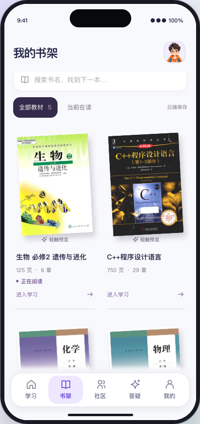
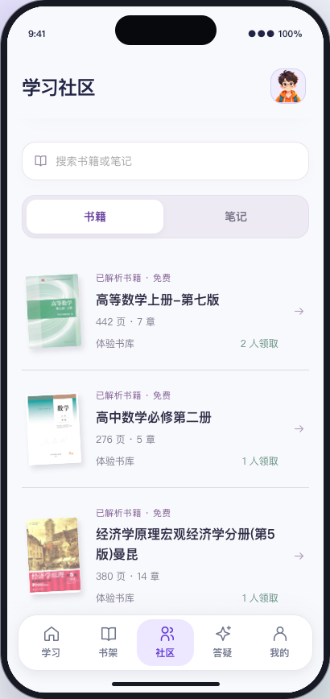
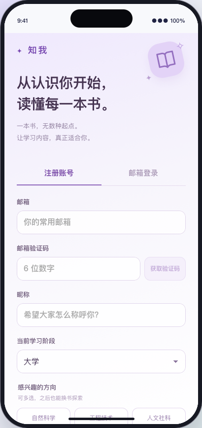
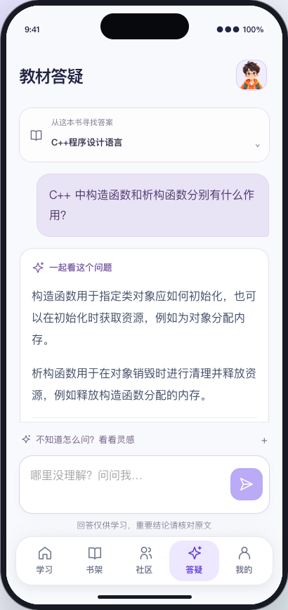

# 知我 · Adaptive Book Learning

> 同一本书，不同的起点，不同的学习路径。

知我围绕 **PDF 教材理解、主动诊断与个性化教学** 构建学习体验：先解析教材，再用由浅入深的选择题了解用户的基础和薄弱点，据此安排讲解深度、学习重点、闪卡与练习。

当前主干对应部署在 4090 上的 React 移动端预览与 FastAPI 后端，包含书架、学习社区、好友聊天和邮箱账号。项目仍处于**受控预览阶段**，不是已完成公网发布验收的正式产品。

## 当前界面

以下为 2026-09-06 从实际运行版本截取的 iPhone 16 等比模拟界面，使用独立测试身份，不是设计稿。

| 我的书架 | 学习社区 |
| --- | --- |
|  |  |

| 邮箱注册 | 选书答疑 |
| --- | --- |
|  |  |

截图中的教材仅用于展示测试效果；本仓库不附带新版预览服务器上的教材 PDF、OCR 文本、检索索引或用户数据库。

## 核心体验

| 模块 | 当前实现 |
| --- | --- |
| 教材处理 | PDF 上传、持久化 OCR 队列、MinerU 解析归一化、质量门控、LLM 清洗及需复核状态 |
| 主动诊断 | 学习背景选择、由浅入深的选择题、自适应选题、信心反馈与可恢复画像 |
| 个性化教学 | 按章节生成不同深度的讲解、总结、知识点清单、原文摘录、闪卡和练习；学习证据影响后续编排 |
| 教材答疑 | 默认当前学习教材，也可选书架中的其他书；混合检索、重排序、原文引用与一致性检查，证据不足时不强行作答 |
| 书架 | 原 PDF 封面/首页、搜索、在读筛选、轻触预览；统一左倾，悬停回正，以留白和细分隔线组织内容 |
| 社区 | 书籍与笔记两类公开分享；领取时检查是否同一本书，复用解析结果，个人学习进度独立保存 |
| 好友 | 唯一用户 ID、昵称/ID 查找、双方同意、文本聊天、站内资料分享、收藏、删除与屏蔽 |
| 我的 | 头像、昵称、年龄等资料；可查看知识验证、学习证据与闪卡复习记录 |
| 账号 | 邮箱验证码注册/登录、学习阶段与兴趣选择、跨浏览器身份恢复、账号缓存隔离及退出登录 |

社区公开发布只保留书籍和笔记；已有闪卡资料及好友私信中的闪卡分享能力仍保留。答疑当前是**单书检索**，尚未实现跨所有书的自动综合回答。

## 技术路线

```text
PDF → OCR / 文本重建 → 清洗与质量检查 → 章节结构与证据化摘要
                                           ├─ 混合检索 + 重排序 → 带原文引用的答疑
                                           └─ 主动诊断 → 掌握画像 → 个性化章节课程
                                                            ↑            ↓
                                                            └─ 练习 / 闪卡反馈
```

- 前端：React、TypeScript、Vite；CSS 动效、键盘/触屏反馈、减弱动态效果支持；Playwright 验收。
- 后端：Python、FastAPI、Pydantic；SQLite 持久化任务、学习会话、账号、好友与消息。
- 文档与 RAG：MinerU、PyMuPDF；持久化索引、关键词与向量混合召回、BGE 编码与重排序、证据校验及有界缓存。
- 学习建模：IRT/CAT、自适应停止条件、Beta 后验与知识追踪、FSRS 复习调度。估计值不等于已经证实的掌握程度。
- 模型服务：支持 PUCODING 与 DeepSeek 后端配置；当前预览答疑使用 PUCODING。模型名称和密钥由服务器配置，不放进前端。

## 仓库结构与旧版迁移

```text
LLM_Study_App/
├── backend/src/adaptive_learning/   # 当前后端
├── backend/tests/                  # 当前后端测试
├── frontend/src/                   # 当前移动端界面
├── frontend/e2e/                   # 浏览器端到端测试
├── frontend/scripts/               # README 实景截图脚本
├── deployment/                     # OCR、RAG、章节与部署工具
├── docs/                           # 模块报告、功能边界与当前截图
└── legacy/cloudpath/               # 旧“云径”主干原样归档
```

原主干 `539e976` 的文件完整保留在 [legacy/cloudpath](legacy/cloudpath/)，提交历史也仍保留。根目录现在是当前“知我”实现；**不要混用旧版的安装命令、环境变量或测试统计**。历史报告只代表其记录时点，不是当前发布承诺。

## 开发启动

建议 Python 3.11+、Node.js 22.18+。以下命令启动开发服务，**不等于已具备完整 OCR / RAG 环境**：真实教材处理还需要 MinerU、模型权重、有效模型服务配置及已构建索引。

### 后端

```sh
cd backend
python3 -m venv .venv
source .venv/bin/activate
python -m pip install -e ".[dev,pdf]"
cp ../.env.example .env
# 编辑 .env：将示例中的服务器绝对路径改为自己的目录。
python -m uvicorn adaptive_learning.api.app:app \
  --env-file .env --host 127.0.0.1 --port 8100 --reload
```

Windows 可使用 `.venv\Scripts\Activate.ps1` 激活环境。健康检查为 `/api/health`，接口文档为 `/docs`；RAG 是否真正就绪应检查 `/api/rag/health`，而不是只看进程启动成功。

### 前端

```sh
cd frontend
npm ci
npm run dev
```

打开 [iPhone 16 模拟界面](http://127.0.0.1:5174/?device=iphone-16)。Vite 将 `/api` 转发到本机 `8100`。模拟器是网页设备预览，不是原生 iOS 模拟器或 APK。

### GPU 与模型配置

在后端安装 `.[rag]` 可选依赖，并按 [OCR 部署说明](deployment/ocr/README.md) 配置 MinerU。根据实际环境填写 [配置模板](.env.example) 中的解析命令、模型路径、RAG 索引目录与模型服务配置。示例路径属于现有部署，不能直接套用到其他机器。

多书预览还依赖已发布教材、章节与索引清单；只克隆代码不会自动下载那 10 本测试书。相关工具位于 `deployment/server/`、`deployment/chaptering/` 和 `deployment/rag/`。

## 4090 部署

当前预览应用、教材与持久化数据位于服务器数据盘，前端构建由后端同源提供。使用 [服务管理脚本](deployment/server/run_backend.sh)，可配置 `APP_ROOT`、`RUNTIME_ROOT` 和 `SECRET_FILE`；默认路径需按目标机器调整。

发布前先备份数据库、源代码和构建，再增量发布，保留 Secret、教材、索引与学习数据。不要把 `legacy/cloudpath/` 当成新版运行目录。

通过 SSH 转发访问已配置的预览：

```sh
ssh -N -L 18100:127.0.0.1:8100 <部署账号>@<4090服务器地址>
```

随后访问 [本机预览](http://127.0.0.1:18100/?device=iphone-16)。这个地址依赖自己的 SSH 隧道，不是公开演示站点。

## 注册、发信与安全边界

- 邮箱验证码具备过期、一次性使用、重发间隔与错误次数限制；会话由 HttpOnly Cookie 保存，服务端只保存令牌哈希。
- **当前预览尚未配置真实邮件投递**。需要配置 SMTP 并完成实际收信验收，才能开放真实邮箱注册。
- `AUTH_DEMO_MODE` 默认关闭。私有预览可显式启用 `.test` 演示账号，页面显示测试验证码；这不代表已发送邮件。演示账号是公共测试身份，不应存放隐私。
- 真实 `.env`、数据库、日志、运行时验证码密钥及含用户资料的测试截图不得提交到 Git。
- 公网发布前仍需完成 HTTPS、邮件投递、旧学习会话统一鉴权迁移、账号注销/导出、举报审核和负载/滥用验收。私信不是端到端加密。

详细说明见 [账号与验证码](docs/accounts-and-verification.md)、[好友与私信](docs/social-system.md)。

## 测试与验收

2026-09-06 最近一次主应用验证：**后端 291 项、前端单元测试 26 项通过，TypeScript / Vite 构建通过**。书架、选书答疑、触屏、空书架与社交共 5 项浏览器测试通过。生物和 C++ 两个真实答疑案例返回了对应教材引用；这不是对所有教材或问题的准确率保证。

```sh
# 当前项目测试；不包含 legacy 中的旧版测试
cd backend
.venv/bin/pytest
.venv/bin/ruff check src tests/test_accounts.py tests/test_social.py
.venv/bin/mypy src
cd ../frontend
npm run test:unit
npm run build
npx playwright install webkit
```

对授权的受控预览执行浏览器验收：

```sh
SOCIAL_E2E_BASE_URL=http://127.0.0.1:18100 npx playwright test \
  e2e/shelf-qa.spec.ts e2e/shelf-edge.spec.ts e2e/social.spec.ts
```

显式设置 `QA_LIVE_E2E=1` 才执行真实模型答疑测试；`ACCOUNT_E2E_SEED_DEMOS=1` 会注册并保留演示账号。不要将这些带写入的测试无差别指向公网生产环境。

## 进一步阅读

- [技术架构](docs/TECHNICAL_ARCHITECTURE.md) · [主动诊断](docs/MODULE_04_ACTIVE_LEARNER_DIAGNOSIS.md) · [个性化课程闭环](docs/MODULE_05_PERSONALIZED_COURSE_LOOP.md)
- [闪卡质量门控](docs/MODULE_10_FLASHCARD_QUALITY.md) · [社区分享](docs/community-release-20260906.md)
- [最新书架、社区与选书答疑验收](docs/shelf-community-qa-refinement.md)

截图可通过 `frontend/scripts/capture-readme.mjs` 从授权私有预览重新生成。旧版说明及第三方通知保留在 `legacy/cloudpath/`。仓库尚未添加项目级 `LICENSE`；依赖、模型与教材的许可需要分别确认。
