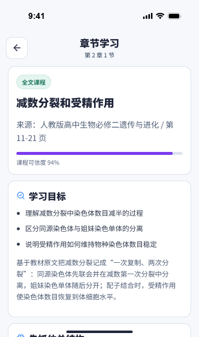
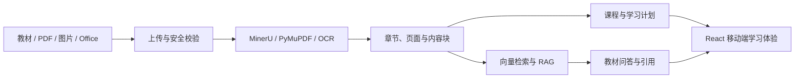

# 云径 CloudPath

> 将教材转换为可追溯、可交互、可持续学习的 AI 课程。

[](https://www.python.org/)
[](https://fastapi.tiangolo.com/)
[](https://react.dev/)
[](https://www.typescriptlang.org/)

云径是一款面向自主学习者的教材智能学习应用。用户可以上传 PDF、图片或 Office 文档，系统会识别原始目录和页面结构，生成与教材内容对应的课程、学习计划、练习与问答，并在回答中保留来源信息。

本仓库是前后端融合版本：前端采用移动端优先的 React 界面，后端基于 FastAPI，覆盖文档解析、OCR、检索增强生成（RAG）、课程生成、作业诊断和学习计划等完整流程。

## 界面预览

| 学习首页 | 章节课程 |
| --- | --- |
|  |  |

## 核心能力

| 模块 | 能力 |
| --- | --- |
| 教材导入 | 支持 PDF、常见图片及 DOCX、PPTX、XLSX，并执行文件签名、资源上限与 OOXML 安全校验 |
| 文档理解 | 结合 MinerU、PyMuPDF 与 PaddleOCR-VL，识别文本、目录、版面、表格、公式和教材插图 |
| 章节保真 | 保留原书章节路径、页码或 Office 位置，允许用户在生成课程前确认目录结构 |
| 智能课程 | 基于教材证据生成学习目标、知识讲解、练习、闪卡与阶段报告 |
| 教材问答 | 通过混合检索与重排序查找相关原文，支持受限上下文的多轮追问，并随回答返回可追溯引用 |
| 划词即学 | 在章节正文中选中文字，可直接要求 AI 通俗解释、举例、出题或沉淀为持久化个人笔记 |
| 导学笔记 | 按教材保存个人笔记，刷新后仍可读取，并与教材摘录集中浏览和删除管理 |
| 学习闭环 | 支持学习计划、作业诊断、错题记录和基于学习结果的后续任务调整 |
| 多端体验 | 提供移动端优先界面以及 iPhone、iPad 设备预览工作台 |

重复教材问答会按教材内容版本执行 TTL/LRU 缓存；同一时刻的相同问题会合并为一次检索与模型请求。问答响应中的 `performance` 字段会返回总耗时、检索耗时、生成耗时与缓存命中状态；`/api/runtime-capabilities` 同时公开缓存容量、在途请求、命中、合并与淘汰计数，便于在 A100 服务上观察交互延迟和请求压力。

教材原文件与解析产物只保存在后端持久化存储，不打包进前端。相同原文件与解析配置再次请求解析时，后端会校验文件 SHA、成功任务以及完整 artifacts，直接复用已完成任务；文件或解析配置变化时才创建新的解析 generation。

## 系统架构



### 技术栈

- 前端：React 19、TypeScript 6、Vite 8、GSAP、Vitest、Playwright
- 后端：Python 3.11–3.12、FastAPI、Pydantic、PyMuPDF、OpenCV
- 文档解析：MinerU、PaddleOCR-VL 1.6、PP-OCRv6
- 检索：BGE-M3、BM25、BGE Reranker；可接入 pgvector、FAISS、Chroma 或 Milvus
- 大模型：支持 DeepSeek，也可通过后端适配其他兼容服务

## 仓库结构

```text
LLM_Study_App/
├── backend/                 # FastAPI 服务、文档流水线、RAG 与业务逻辑
│   ├── app/
│   ├── migrations/
│   └── pyproject.toml
├── frontend/                # React 应用、移动端界面与自动化测试
│   ├── src/
│   ├── e2e/
│   └── package.json
├── quality/                 # 分阶段质量基线、真实样例与验收报告
├── PRD-BookCourseAI.md      # 产品需求文档
└── PRODUCT.md               # 产品定位与设计原则
```

更详细的实现说明请参阅 [后端文档](backend/README.md) 和 [前端文档](frontend/README.md)。

## 快速开始

### 环境要求

- Python 3.11 或 3.12
- Node.js 22 或更高版本
- npm 10 或更高版本

以下配置使用无需外部解析服务、数据库或 API Key 的本地开发模式，适合体验带文本层的 PDF。

### 1. 启动后端

```powershell
cd backend
python -m venv .venv
.\.venv\Scripts\Activate.ps1
python -m pip install --upgrade pip
python -m pip install -e ".[test]"

$env:BOOKCOURSE_AUTH_MODE="optional"
$env:BOOKCOURSE_PARSER_PROVIDER="pymupdf"
$env:BOOKCOURSE_RAG_INDEX_PROVIDER="artifact"
$env:BOOKCOURSE_USE_WORKER="false"

python -m uvicorn app.main:app --reload --host 127.0.0.1 --port 8000
```

macOS 或 Linux 激活虚拟环境时使用：

```bash
source .venv/bin/activate
```

后端启动后可访问：

- API 文档：<http://127.0.0.1:8000/docs>
- 健康检查：<http://127.0.0.1:8000/api/health>

### 2. 启动前端

新开一个终端：

```powershell
cd frontend
npm ci
Copy-Item .env.example .env
npm run dev -- --host 127.0.0.1 --port 5173
```

访问地址：

- 设备预览工作台：<http://127.0.0.1:5173/>
- 应用界面：<http://127.0.0.1:5173/?embedded=device-preview>

macOS 或 Linux 可使用 `cp .env.example .env` 创建前端环境文件。

## 高精度 OCR 与检索配置

扫描教材、复杂表格和公式建议安装完整 OCR 与 RAG 依赖：

```powershell
cd backend
python -m pip install -e ".[test,ocr,rag]"

$env:BOOKCOURSE_PARSER_PROVIDER="mineru"
$env:BOOKCOURSE_MINERU_BACKEND="hybrid"
$env:BOOKCOURSE_MINERU_EFFORT="high"
$env:BOOKCOURSE_OCR_PROVIDER="paddleocr-vl"
$env:BOOKCOURSE_OCR_MODEL="PaddleOCR-VL-1.6"
$env:BOOKCOURSE_OCR_QUALITY_PROFILE="quality"
$env:BOOKCOURSE_OCR_TEXT_FALLBACK_ENABLED="true"
$env:BOOKCOURSE_OCR_CACHE_ENABLED="true"
$env:BOOKCOURSE_EMBEDDING_PROVIDER="bge_m3"
$env:BOOKCOURSE_RERANKER_PROVIDER="bge"
```

默认 MinerU 服务地址为 `http://127.0.0.1:8001`。没有 GPU 时可以使用 CPU，但复杂页面解析耗时会明显增加。完整参数及部署约束见 [后端文档](backend/README.md)。

## 大模型配置

如需启用真实课程生成和教材问答，可在后端进程中设置：

```powershell
$env:BOOKCOURSE_LLM_PROVIDER="deepseek"
$env:BOOKCOURSE_RAG_LLM_PROVIDER="deepseek"
$env:BOOKCOURSE_DEEPSEEK_API_KEY="<your-api-key>"
$env:BOOKCOURSE_DEEPSEEK_LESSON_MODEL="deepseek-v4-pro"
$env:BOOKCOURSE_DEEPSEEK_RAG_MODEL="deepseek-v4-flash"
```

> 安全提示：API Key 只能保存在后端环境变量或密钥管理服务中。不要提交真实 `.env` 文件，也不要将后端密钥写入任何 `VITE_*` 变量，因为它们会进入浏览器构建产物。

## 支持的文件格式

- 文档：PDF、DOCX、PPTX、XLSX
- 图片：PNG、JPG/JPEG、JP2、WEBP、单帧 GIF、BMP、单页 TIF/TIFF
- 不支持：旧版二进制 Office 格式 `.doc`、`.ppt`、`.xls`

上传文件会在解析前进行格式真实性、加密状态、页面或像素数量、压缩包结构及主动内容等安全检查。

## 测试与质量检查

后端：

```powershell
cd backend
python -m pytest
```

前端：

```powershell
cd frontend
npm run lint
npm test
npm run build
npm run test:e2e
```

当前融合快照已通过：

- 后端：379 项测试通过，9 项环境相关测试跳过
- 前端：27 个测试文件、218 项测试通过
- ESLint：通过
- TypeScript 与 Vite 生产构建：通过

## 配置与数据安全

- 后端配置模板：[`backend/.env.example`](backend/.env.example)
- 前端配置模板：[`frontend/.env.example`](frontend/.env.example)
- 正式环境应启用 `BOOKCOURSE_AUTH_MODE=strict` 并配置服务端身份认证
- `backend/data/`、构建产物、依赖目录、日志及本地密钥均已通过 `.gitignore` 排除
- AI 生成图片会与教材原图分开标记，并保留来源内容块，避免混淆原始证据

## 项目状态

项目目前处于持续开发与产品演示阶段。接口、数据结构和部署配置仍可能调整；生产部署前请完成独立的安全审计、容量评估和模型服务配置。

## 许可证

本仓库暂未声明开源许可证。在正式添加 `LICENSE` 文件前，默认保留所有权利；未经仓库所有者许可，请勿复制、分发或用于商业用途。
